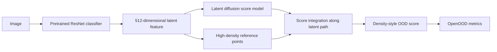

# Diffusion-Based Uncertainty Quantification (UQ)

This repository contains code and experiments from a research project conducted at ISIR, focused on **uncertainty quantification (UQ)** using **diffusion models**. The goal of the project was to develop a **density-based method for OOD detection** leveraging the score-based formulation of diffusion models.

The method was benchmarked against state-of-the-art approaches and integrated into the [OpenOOD](https://github.com/zhangmarvin/openood) framework for large-scale evaluation.

## Project Status

This repository is a research prototype. It contains the implementation, historical experiment outputs, and draft write-up for a diffusion-based OOD detection method developed during a research project at ISIR.

A draft of the unfinished article can be found here:  
 [`article_UQ.pdf`](./article_UQ.pdf)

## Overview of the Method

The proposed method approximates log-density using the **learned score function of a diffusion model**, integrated along a path from the query point to a high-density reference point.



The main contribution is the post-hoc OOD score: instead of using only a local score norm or reconstruction error, the method integrates the learned diffusion score field between an input feature and high-density reference points. This gives a practical approximation of a log-density difference in classifier feature space.

## Results

The following AUROC results are reported in the draft article.

| ID dataset | CIFAR-10 / CIFAR-100 | TinyImageNet | MNIST | SVHN | Texture | Places365 | Mean |
| --- | ---: | ---: | ---: | ---: | ---: | ---: | ---: |
| CIFAR-10 | 0.891 | 0.909 | 0.937 | 0.921 | 0.931 | 0.907 | 0.916 |
| CIFAR-100 | 0.670 | 0.751 | 0.779 | 0.763 | 0.789 | 0.722 | 0.746 |

Comparison against reimplemented diffusion-based baselines on CIFAR-100:

| Method | Mean AUROC |
| --- | ---: |
| MSMA | 0.552 |
| DiffPath 6D | 0.618 |
| DDPM-OOD | 0.704 |
| NLL | 0.724 |
| Dense coverage score integration (ours) | 0.746 |

## Re-running The OOD Evaluation

The evaluation scripts are meant to be run from the repository root with a CUDA-capable environment. A GPU is effectively required: the scripts call `.cuda()` directly, the custom diffusion postprocessors run score integration on GPU, and `requirements.txt` includes `faiss-gpu`.

Install the Python dependencies first:

```bash
pip install -r requirements.txt
```

The large artifacts are intentionally not tracked by git. Before running an evaluation, check that these are present:

- `data/` with the OpenOOD-style image folders and benchmark image lists.
- `pretrained_models/cifar10_res18_v1.5/cifar10_resnet18_32x32_base_e100_lr0.1_default/s0/best.ckpt` for CIFAR-10.
- `pretrained_models/cifar100_resnet18_32x32_base_e100_lr0.1_default/s0/best.ckpt` for CIFAR-100.
- `model_checkpoint_latent_linear.pth` for the CIFAR-10 latent diffusion model.

To rerun the CIFAR-10 version of the proposed method:

```bash
python src/eval_mine_test.py
```

This writes `ood_results_test_ours.csv`.

To rerun the CIFAR-100 version of the proposed method:

```bash
python src/eval_mine_cifar100.py
```

This writes `ood_results_test_100.csv`.

For the broader benchmark/reimplemented baselines:

```bash
python src/eval_mine.py
```

This writes the individual baseline CSVs and `ood_results_full.csv`. That path is heavier than the single-method scripts.


## Disclaimer

This is a personal research project carried out in collaboration with ISIR. The code is shared for reference purposes only.

## Contact

For questions, feel free to contact me at:    
 thibaultrobine68@gmail.com

